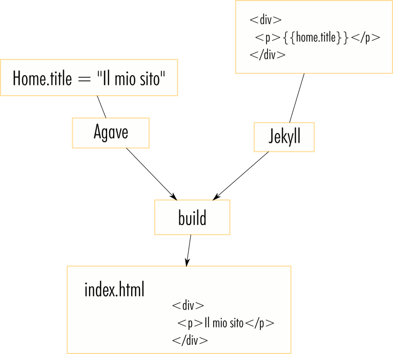

# Introduzione

# Area amministrativa

Agave è un CMS studiato per permettere la creazione e generazione di
siti statici tramite Jekyll.

### Come funziona

Tramite un'apposita area di amministrazione è possibile impostare i
contenuti da visualizzare che poi saranno trasmessi, tramite una serie
di funzioni al vero generatore che procederà a creare tramite un layout
predefinito le varie pagine di cui si compone il sito finale.

Non è necessario conoscere alcun linguaggio o avere dimestichezza con
interfacce di amministrazione (es. Wordpress) in quanto tutte le pagine
ed i contenuti sono perfettamente predisposti per essere utilizzati
da chiunque.

#### Gestione Contenuti

Accedendo all'area amministrativa si visualizza una sezione che
presenta la lista di centenuti editabili disponibili sul sistema.

Ogni voce della lista corrisponde ad un'elemento che successivamente,
dopo aver lanciato un DEPLOY, potra essere accessibile sul sito
statico generato.

Accedendo ad una voce della sezione si vedra un modulo di inserimento
dei dati che presenta diversi attributi a seconda che l'elemento sia
singolo o multiplo.

##### Campi disponibili

1. Stringa di testo
All'interno del campo potra essere inserita una stringa alfanumerica;
il campo potrebbe contenere delle specifiche e validazioni che dovranno
essere rispettate

2. Editor HTML
Il campo Editor HTML permette di inserire testi lunghi che
corrispondono al contenuto effettivo della pagina o dell'elemento;
non e possibile inserire immagini a meno di modificare direttamente il
codice sorgente tramite l'apposito campo presente a destra dell'editor

3. Campo numerico
Il campo accetta solamente valori numerici (interi o con la virgola)

4. Campo switch
Il campo corrisponde ad un pulsante di scelta (acceso/spento)

5. Campo Media
In questo campo, a seconda della tipologia di elemento del sistema, è
possibile caricare uno o piu allegati; Tutti gli allegati caricati
all'interno del sistema saranno gestibili nella sezione MEDIA
dell'interfaccia amministrativa

6. Campo Data/Ora
In questo campo è possibile inserire tramite un pop-up calendario, una
data e/o un orario

7. Campo Slug
Il campo slug contiene solitamente la voce parametrizzata per la
costruzione dell'URL finale della pagina o dell'elemento che si sta
costruendo o modificando

8. Campo Posizione
Tramite questo campo è possibile selezionare una posizione precisa su
una mappa cosi da poterla utilizzare per visualizzare una mappa anche
sul sito statico generato

9. Campo SEO
Il campo SEO visualizza una modale contenente TITOLO, DESCREIZIONE ed
IMMAGINE per l'ottimizzazione ed indicizzazione della pagina statica
corrispondente

10. Campo Video
Il sistema supporta la possibilita di caricare video tramite link
esterni a Youtube e Vimeo; Ogni video deve essere configurato come
disponibile e non in modalita privata

11. Campi modulari
Permette di utilizzare tipi di dati composti preconfigurati come
blocchi di elementi.

#### Media

Tramite la sezione MEDIA si possono caricare, modificare o cancellare
allegati caricati. Per caricare una nuova immagine o documento è
sufficiente trascinare all'interno dell'interfaccia amministrativa
il file ed attendere il suo caricamento.

Una volta caricato si potra modificare il titolo e l'alt così da
permettere una maggiore ottimizzazione a livello SEO.

** N.B **
Il sistema verifica se l'allegato e collegato o meno da un elemento
dei contenuti ed in questo caso non permette l'eliminazione finche non
viene rimosso il collegamento.

# Sito statico (SSG)

Un repository git conterrà il template [Jekyll](https://jekyllrb.com/)
del sito. Ovvero, tutti i file necessari per generare un sito statico
a partire dai dati fruiti da Agave.

Un generatore di siti statici permette di creare l'intera struttura
del sito direttamente in HTML. Il sistema si comporta come un
contenitore di DATI ed ALLEGATI che poi saranno direttamente inseriti
nelle relative pagine HTML del sito finale.

## Perchè usare generatore di siti statici

I vantaggi principali rispetto ad un sito standard (DINAMICO) o ad un
CMS sono:
* Sicurezza: il sito è composto solo di file html statici e dunque
  inattaccabile (non è possibile eseguire script malevoli all'interno
  del server).
* Performance: il sito viene precompilato prima di essere deployato.
  L'utente finale potrà utilizzare la cache per caricare solo i
  contenuti modificati.

# Ambiente di produzione (Docker)

L'ambiente Docker sarà la macchina virtuale che sovraintenderà alla
generazione del sito statico a partire dai file contenuti nel repository
git e dai dati fruiti da Agave. Inoltre permetterà di accedere via
web al sito compilato e all'area di amministrazione per la generazione
dei contenuti.

## Cos'è [Docker](https://www.docker.com/)

Docker è una piattaforma software che permette di creare build,
testare e distribuire applicazioni con la massima rapidità. Docker
raccoglie il software in unità standardizzate chiamate container che
offrono tutto il necessario per la loro corretta esecuzione, incluse
librerie, strumenti di sistema, codice e runtime. Con Docker, è
possibile distribuire e ricalibrare le risorse per un'applicazione
in qualsiasi ambiente, tenendo sempre sotto controllo il codice
eseguito.

## Perchè Docker

Docker permette di distribuire il codice più rapidamente,
standardizzare il funzionamento delle applicazioni, trasferire codice
in modo ottimizzato e risparmiare denaro migliorando l'utilizzo delle
risorse. Con Docker è possibile ottenere un singolo oggetto che può
essere eseguito in modo affidabile in qualsiasi posizione. La sua
sintassi è semplice e permette di tenere le risorse sotto controllo.

Il fatto che sia già diffuso significa che offre un ecosistema di
strumenti e applicazioni pronte all'uso.
