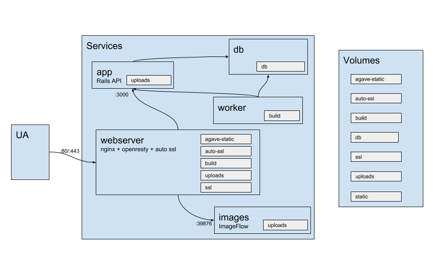
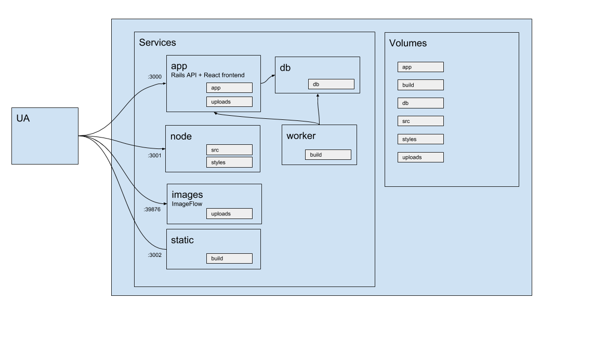

# Struttura Docker

Per orchestrare i servizi abbiamo usato
[Docker-Compose](https://docs.docker.com/compose), una sovrastruttura
che permette di gestire più servizi [Docker](https://www.docker.com)
da configurazione.

Tutti i file di configurazione relativi a Docker e Docker-Compose
sono contenuti nella sottocartella `docker` della root del progetto.

## Servizi

I servizi che utilizziamo nella nostra implementazione sono i seguenti:

- db: Database [Postgres](https://www.postgresql.org).
- images: il container dove vengono gestite le immagini con ImageFlow,
  ottimizzate e servite ad Agave e sito.
- webserver: Il server [Nginx](https://www.nginx.com) che risponde
  alle richieste HTTP, gestisce i certificati SSL e smista le richieste
  verso il server delle immagini e il sito statico
- App: L’applicazione rails (AGAVE)
- worker: Il worker che si occupa di eseguire i jobs (che servono per
  buildare il sito statico)

## Volumi

I volumi dove immagazziniamo i nostri dati sono:
- agave-static: dove viene immagazzinato il sito statico finale
- uploads: dove stanno le immagini
- ssl: All’avvio di [Nginx](https://www.nginx.com), il server ha
  bisogno di un certificato, ma [Let'sEncrypt](https://letsencrypt.org/)
  non può servirlo, quindi generiamo un self-signed. Autogenerando
  questo certificato (tramite uno script) si creano 3 file
  ( cert, key, dhparam.pen ) che verranno immagazzinati nel volume SSL.
- auto-ssl: Una volta che il server è partito, la gestione dei
  certificati passa ad [OpenResty](https://openresty.org) ed auto-ssl.
- build: contiene i file statici generati dalla compilazione.
- db: dove vengono immagazzinati i dati del database postgres


# Struttura dell'applicazione in Production


# Struttura dell'applicazione in Development


# Docker Compose file sample:

```
version: "3"

services:
  db:
    image: postgres:9.6
    volumes:
      - db:/var/lib/postgresql/data

  images:
    image: italia/agavecms_images:latest
    working_dir: /images
    volumes:
      - uploads:/images/uploads
    ports:
      - "39876:39876"

  app:
    image: italia/agavecms_app:latest
    working_dir: /app
    command: ./start
    ports:
      - "3000:3000"
    stdin_open: true
    tty: true
    depends_on:
      - db
    volumes:
      - agave-static:/app/static
      - uploads:/app/public/uploads

  webserver:
    image: italia/agavecms_webserver:latest
    env_file: ../.env
    depends_on:
      - app
      - images
    ports:
      - "80:80"
      - "443:443"
    volumes:
      - agave-static:/webserver/agave
      - auto-ssl:/etc/resty-auto-ssl
      - ssl:/webserver/ssl
      - uploads:/webserver/uploads
      - build:/webserver/static_site

  worker:
    image: italia/agavecms_app:latest
    command: bundle exec rake jobs:work
    restart: on-failure
    ports: []
    volumes:
      - build:/app/tmp/build

volumes:
  agave-static:
  auto-ssl:
  build:
  db:
  ssl:
  uploads:
```
